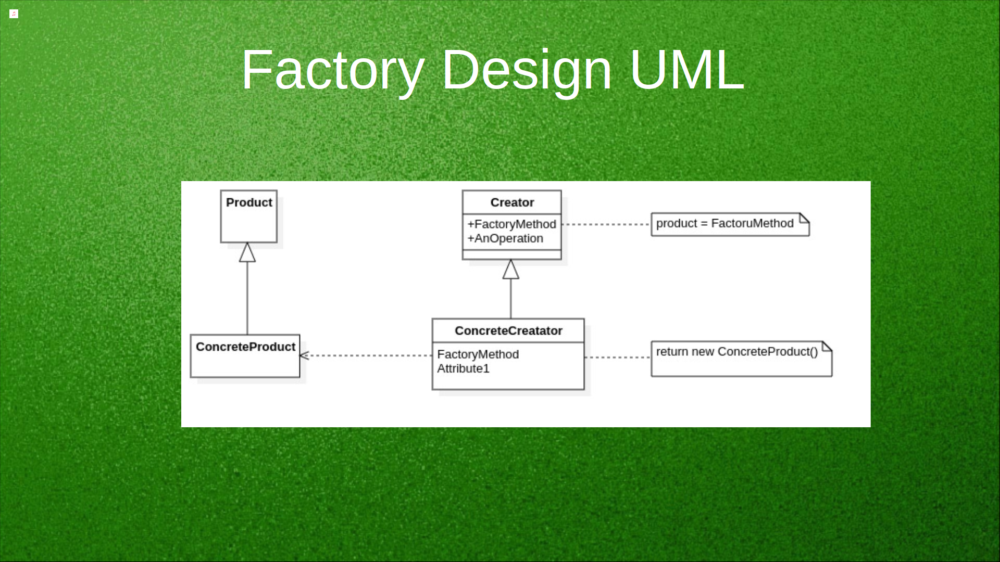

# [TheRayCode](../../../README.md) is AWESOME!!!

[top](../README.md)

**[Creational Patterns](../README.md)** | **[Structural Patterns](../../Structural/README.md)** | **[Behavioral Patterns](../../Behavioral/README.md)**

**C++ Factory Design Pattern**

|Example in C++|   |   |   |
|---|---|---|---|
|  [**Factory**](../Factory/README.md) | [**C#**](../../../Csharp/Creational/Factory/README.md) | [Java](../../../Java/Creational/Factory/README.md) | [PHP](../../../PHP/Creational/Factory/README.md) |

[Example](Example/README.md) | [Example2](Example2/README.md) | [Example3](Example3/README.md)

https://vimeo.com/1065236128

The Factory design pattern deals with the problem of creating objects without specifying the exact class of object that will be created. Instead of calling a constructor directly to create an object, a factory method is employed to create the object. This factory method is typically defined in an interface, which is implemented by concrete classes. The pattern is thus about delegating the responsibility of object instantiation to specialized methods, rather than directly instantiating objects with constructors.

There are variations of this pattern such as Simple Factory, Factory Method, and Abstract Factory (which we discussed earlier). But at its core, the Factory pattern revolves around the idea of using a method to produce instances, abstracting away the instantiation logic.

**Importance for a C++ Developer**:

https://vimeo.com/1065236128

1. **Decoupling**: The Factory pattern allows for a decoupling of the client code (which needs the object) from the code that instantiates the object. This decoupling means changes in one area (like adding new object types) are less likely to impact other areas of the code.

2. **Flexibility**: By deferring object creation to factory methods, it becomes easier to introduce new object types without changing existing code. The client simply interacts with the new factory or the modified factory to get the new object type.

3. **Centralized Object Creation**: By centralizing the object creation process, the Factory pattern ensures consistency and can lead to easier maintenance. If there's a need to change how objects are created, it's done in one place: the factory.

4. **Hide Complex Creation Logic**: Some objects might require intricate setup before they're ready for use. The Factory pattern can hide this complexity, ensuring the client receives a fully initialized, ready-to-use object.

5. **Dynamic Runtime Decisions**: The Factory pattern allows for decisions about which class to instantiate to be made at runtime, based on certain conditions or parameters. This brings about a dynamic aspect to object creation.

6. **Better Resource Management**: C++ being a language where resource (especially memory) management is crucial, factories can help ensure that objects are efficiently created and destroyed, assisting in resource management.

7. **Consistent Object Initialization**: If there are mandatory post-construction steps for an object (e.g., setting certain fields, initializing resources), a factory method ensures these steps are always executed, guaranteeing a consistent state for each created object.

In summary, for C++ developers, understanding the Factory design pattern provides a powerful means to abstract away the complexities and intricacies of object creation, resulting in cleaner, more maintainable, and scalable code.

### **S.W.O.T. Analysis of the Factory Method Design Patterns for C++**

https://vimeo.com/1065235757

**Strengths**  
1. **Encapsulation**: Hides object creation logic, reducing dependencies on concrete classes in C++.  
2. **Extensibility**: Adding new object types requires extending the factory without modifying client code.  
3. **Polymorphism**: C++ supports efficient use of polymorphism to create objects dynamically.

**Weaknesses**  
1. **Virtual Functions Overhead**: Requires the use of virtual functions, which can introduce minor runtime overhead.  
2. **Code Proliferation**: Generates additional classes and functions, increasing the complexity of smaller projects.  
3. **Manual Memory Management**: Improper handling of dynamically allocated objects can lead to memory issues.

**Opportunities**  
1. **Game Development**: Frequently used to generate game entities or levels dynamically in C++.  
2. **Plugin Frameworks**: Suitable for building extensible plugin architectures in C++ systems.  
3. **Cross-Platform Compatibility**: Helps in developing portable object creation mechanisms for C++ libraries.

**Threats**  
1. **Performance Risks**: Overuse of virtual functions and dynamic allocation may degrade performance in high-throughput systems.  
2. **Overengineering**: Misapplication in simple scenarios might unnecessarily complicate the code.  
3. **Modern Alternatives**: Concepts like templates and constexpr can replace factory patterns in some scenarios.

---

[TheRayCode.ORG](https://www.TheRayCode.org)

[RayAndrade.COM](https://www.RayAndrade.com)

[Facebook](https://www.facebook.com/TheRayCode/) | [X @TheRayCode](https://www.x.com/TheRayCode/) | [YouTube](https://www.youtube.com/TheRayCode/)
