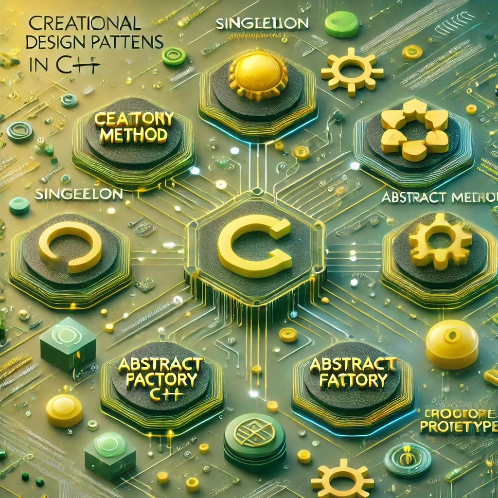

# [TheRayCode](../../README.md) is AWESOME!!!

[top](../README.md)

**[Creational Patterns](./README.md)** | **[Structural Patterns](../Structural/README.md)** | **[Behavioral Patterns](../Behavioral/README.md)**

**C++ Creational Patterns**

| examples using C++ | | | |
|----|---|---|---|
|**[Abstract Factory](./AbstractFactory/README.md)**  | [C#](../../Csharp/Creational/AbstractFactory/README.md) | [Java](../../Java/Creational/AbstractFactory/README.md) | [PHP](../../PHP/Creational/AbstractFactory/README.md) |
|**[Builder](./Builder/README.md)**  | [C#](../../Csharp/Creational/Builder/README.md) | [Java](../../Java/Creational/Builder/README.md) | [PHP](../../PHP/Creational/Builder/README.md) |
|**[Factory](./Factory/README.md)**  | [C#](../../Csharp/Creational/Factory/README.md) | [Java](../../Java/Creational/Factory/README.md) | [PHP](../../PHP/Creational/Factory/README.md) |
|**[Prototype](./Prototype/README.md)**  | [C#](../../Csharp/Creational/Prototype/README.md) | [Java](../../Java/Creational/Prototype/README.md) | [PHP](../../PHP/Creational/Prototype/README.md) |
|**[Singleton](./Singleton/README.md)**  | [C#](../../Csharp/Creational/Singleton/README.md) | [Java](../../Java/Creational/Singleton/README.md) | [PHP](../../PHP/Creational/Singleton/README.md) |

### **Outline for Creational Patterns in C++**

Creational patterns focus on the mechanisms of object creation. They abstract the instantiation process to make systems more flexible, reusable, and decoupled from specific implementations. In C++, these patterns leverage the language’s features like polymorphism, static functions, memory management, and templates to provide efficient solutions.

---

### **[1. Singleton Pattern](./Singleton/README.md)**
#### *Definition:*  
Ensures a class has only one instance and provides a global point of access to it.

#### *How It Fits the Category:*  
The Singleton pattern controls the instantiation of a class by ensuring only one object is ever created. It’s particularly useful when exactly one instance of a class is required, such as in managing configuration settings or logging.

#### *Implementation in C++:*
- Use a `private` constructor to restrict direct instantiation.
- A `static` method provides global access to the instance.
- Lazy initialization ensures the object is created only when needed.
- Thread safety can be achieved using `std::mutex` or static initialization guards.

---

### **[2. Factory Method Pattern](./Factory/README.md)**
#### *Definition:*  
Provides an interface for creating objects while allowing subclasses to decide the type of object to instantiate.

#### *How It Fits the Category:*  
The Factory Method abstracts the instantiation process, enabling the creation of objects without specifying their concrete classes. It helps maintain open/closed principles, where adding new types requires minimal code changes.

#### *Implementation in C++:*
- Define a base class with a `virtual` method for object creation.
- Concrete subclasses override this method to create specific object types.
- Use polymorphism to handle object behavior at runtime.

---

### **[3. Abstract Factory Pattern](./AbstractFactory/README.md)**
#### *Definition:*  
Provides an interface for creating families of related or dependent objects without specifying their concrete classes.

#### *How It Fits the Category:*  
Abstract Factory extends the Factory Method to handle groups of objects. It decouples the creation of related objects, ensuring consistency and flexibility in managing families of products.

#### *Implementation in C++:*
- Define an abstract base class for the factory with `virtual` methods to create related objects.
- Implement concrete factory classes for specific families of products.
- Use polymorphism to manage different product families seamlessly.

---

### **[4. Builder Pattern](./Builder/README.md)**
#### *Definition:*  
Separates the construction of a complex object from its representation, allowing the same construction process to create different representations.

#### *How It Fits the Category:*  
The Builder pattern focuses on constructing complex objects step by step. It isolates the construction logic from the final object, making it easier to create and maintain complex data structures.

#### *Implementation in C++:*
- Define a `Builder` interface with methods for each step of object construction.
- Implement concrete builders for different object representations.
- Use a `Director` class to manage the construction sequence.

---

### **[5. Prototype Pattern](./Prototype/README.md)**
#### *Definition:*  
Creates new objects by cloning existing ones.

#### *How It Fits the Category:*  
The Prototype pattern reduces the cost of object creation by reusing existing objects as templates. It’s ideal for scenarios where creating objects from scratch is resource-intensive.

#### *Implementation in C++:*
- Define a base class with a `clone` method, often implemented using `virtual` functions.
- Concrete classes override the `clone` method to perform deep or shallow copies.
- Use the `clone` method to create new instances at runtime.

---

### **Key Differences and Relations Within the Category:**
- **[Singleton](./Singleton/README.md)** ensures a single instance, while **[Prototype](./Prototype/README.md)** allows multiple instances based on a template.
- **[Factory Method](./Factory/README.md)** and **[Abstract Factory](./AbstractFactory/README.md)** abstract the creation process, focusing on object families in the case of **[Abstract Factory](./AbstractFactory/README.md)**.
- **[Builder](./Builder/README.md)** handles the step-by-step construction of complex objects, often complementing **[Abstract Factory](./AbstractFactory/README.md)** by focusing on the internal composition of products.
- **[Prototype](./Prototype/README.md)** provides an alternative to **[Factory](./Factory/README.md)** patterns by enabling object cloning instead of instantiation.

---

### **How These Patterns Leverage C++:**
1. **Memory Management:** C++ provides explicit control over object creation and destruction using constructors, destructors, and smart pointers, which enhance the flexibility of these patterns.
2. **Polymorphism:** Virtual functions and inheritance allow the seamless implementation of Factory, Abstract Factory, and Prototype patterns.
3. **Templates:** Builder and Factory patterns can benefit from templates to create generic solutions.
4. **Static Members:** Singleton heavily relies on static members and functions to enforce its constraints.

---

By mastering these patterns in C++, developers can effectively manage object creation, ensuring code that is efficient, extensible, and easier to maintain.

[TheRayCode.ORG](https://www.TheRayCode.org)

[RayAndrade.COM](https://www.RayAndrade.com)

[Facebook](https://www.facebook.com/TheRayCode/) | [Twitter @TheRayCode](https://www.twitter.com/TheRayCode/) | [YouTube](https://www.youtube.com/TheRayCode/)
