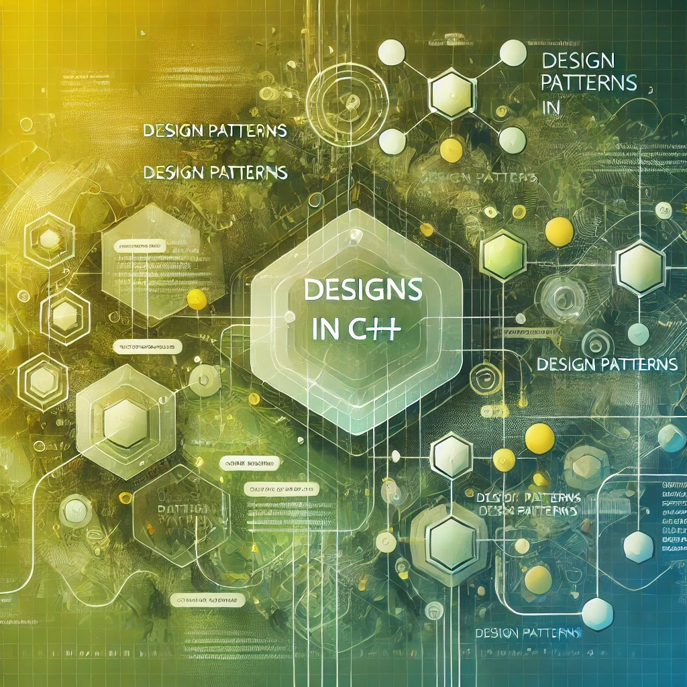

[top](../README.md)

|**[Creational Patterns](./Creational/README.md)** | **[Structural Patterns](./Structural/README.md)** | **[Behavioral Patterns](./Behavioral/README.md)** |
|---|---|---|
|**[C#](../Csharp/Creational/README.md)** | **[C#](../Csharp/Structural/README.md)** | **[C#](../Csharp/Behavioral/README.md)** |
|**[Java](../Java/Creational/README.md)** | **[Java](../Java/Structural/README.md)** | **[Java](../Java/Behavioral/README.md)** |
|**[PHP](../PHP/Creational/README.md)** | **[PHP](../PHP/Structural/README.md)** | **[PHP](../PHP/Behavioral/README.md)** |

**[C++](../README.md)** 

| Creational Patterns | Structural Patterns | Behavioral Patterns |
|--------------|-----|-----------|
| [**AbstractFactory**](./Creational/AbstractFactory/README.md) | [**Adapter**](./Structural/Adapter/README.md)         | [**Chain Of Responsibility**](./Behavioral/ChainOfResponsibility/README.md) |
| [**Builder**](./Creational/Builder/README.md)                 | [**Bridge**](./Structural/Bridge/README.md)           | [**Command**](./Behavioral/Command/README.md) |
| [**Factory**](./Creational/Factory/README.md)                 | [**Composite**](./Structural/Composite/README.md)     | [**Interpreter**](./Behavioral/Interpreter/README.md) |
| [**Prototype**](./Creational/Prototype/README.md)             | [**Decorator**](./Structural/Decorator/README.md)     | [**Iterator**](./Behavioral/Iterator/README.md) |
| [**Singleton**](./Creational/Singleton/README.md)             | [**Facade**](./Structural/Facade/README.md)           | [**Mediator**](./Behavioral/Mediator/README.md) |
|                                                               | [**Flyweight**](./Structural/Flyweight/README.md)     | [**Memento**](./Behavioral/Memento/README.md)  |
|                                                               | [**Proxy**](./Structural/Proxy/README.md)             | [**Observer**](./Behavioral/Observer/README.md) |
|                                                               |                                                       | [**State**](./Behavioral/State/README.md)  |
|                                                               |                                                       | [**Strategy**](./Behavioral/Strategy/README.md)  |
|                                                               |                                                       | [**Template**](./Behavioral/Template/README.md) |
|                                                               |                                                       | [**Visitor**](./Behavioral/Visitor/README.md) |

### **Promotional Outline: Mastering Design Patterns in C++**

Welcome to *Mastering Design Patterns in C++*, a course designed for students passionate about programming and eager to refine their skills in one of the most powerful programming languages. This course explores the 23 essential design patterns from the Gang of Four and demonstrates how C++'s object-oriented features, templates, and memory management capabilities make it an excellent choice for implementing these patterns. Through real-world examples, practical exercises, and in-depth discussions, you'll learn to build robust, efficient, and scalable software systems.

---

## **Introduction to Design Patterns**

- **What are Design Patterns?**  
  Design patterns are reusable solutions to common programming problems. They provide a proven framework for writing flexible and maintainable code.

- **Why Use Design Patterns in C++?**  
  C++’s low-level control, high performance, and object-oriented features make it a versatile language for applying design patterns. Mastering these patterns in C++ is essential for developing everything from games to operating systems.

---

### **[1. Creational Patterns](./Creational/README.md)**
#### *Definition:*  
Creational patterns provide solutions to object creation, ensuring flexibility and reducing coupling between the system and specific implementations.

1. **[Singleton](./Creational/Singleton/README.md)**  
   Ensures a class has only one instance and provides a global point of access. C++ supports Singleton implementation with private constructors, static members, and thread-safe initialization. Commonly used for logging, configuration, and resource management.

2. **[Factory Method](./Creational/Factory/README.md)**  
   Defines an interface for creating objects but lets subclasses determine the type of object to create. C++’s inheritance and polymorphism make this pattern ideal for decoupling object creation. Frequently used in cross-platform systems.

3. **[Abstract Factory](./Creational/AbstractFactory/README.md)**  
   Provides an interface for creating families of related or dependent objects without specifying their concrete classes. Using C++’s abstract classes and templates, this pattern is perfect for creating platform-specific UI components or game assets.

4. **[Builder](./Creational/Builder/README.md)**  
   Separates the construction of a complex object from its representation, allowing the same process to create different representations. C++'s fluent APIs and chainable methods are ideal for this pattern, as seen in constructing complex data structures like trees or graphs.

5. **[Prototype](./Creational/Prototype/README.md)**  
   Creates new objects by cloning existing ones. C++’s copy constructors and deep-copy techniques make Prototype straightforward to implement. Useful for scenarios like cloning expensive-to-create objects.

#### *How They Relate:*  
- **[Factory Method](./Creational/Factory/README.md)** is a subset of **[Abstract Factory](./Creational/AbstractFactory/README.md)** for single-object creation.
- **[Builder](./Creational/Builder/README.md)** complements **[Abstract Factory](./Creational/AbstractFactory/README.md)** by constructing complex objects step by step.
- **[Prototype](./Creational/Prototype/README.md)** and **[Singleton](./Creational/Singleton/README.md)** focus on specific aspects of object creation, such as copying or ensuring a single instance.

---

### **[2. Structural Patterns](./Structural/README.md)**
#### *Definition:*  
Structural patterns focus on class and object composition, helping to build systems that are modular and extensible.

1. **[Adapter](./Structural/Adapter/README.md)**  
   Converts one interface into another expected by clients. C++'s multiple inheritance and operator overloading make implementing adapters seamless. Useful for integrating legacy code or third-party libraries.

2. **[Bridge](./Structural/Bridge/README.md)**  
   Decouples an abstraction from its implementation, allowing them to vary independently. C++’s pointers and virtual functions are well-suited for implementing this pattern. Ideal for GUI frameworks and rendering systems.

3. **[Composite](./Structural/Composite/README.md)**  
   Composes objects into tree structures to represent part-whole hierarchies. C++'s recursive structures and polymorphism make it perfect for implementing this pattern in file systems or graphical applications.

4. **[Decorator](./Structural/Decorator/README.md)**  
   Dynamically adds behavior to an object without modifying its structure. C++'s support for object composition and operator overloading facilitates this pattern. Commonly used for extending functionality in streams and I/O systems.

5. **[Facade](./Structural/Facade/README.md)**  
   Provides a unified interface to a complex subsystem. C++ makes it easy to encapsulate subsystems into a single class, simplifying client access. Often used in simplifying graphics APIs.

6. **[Flyweight](./Structural/Flyweight/README.md)**  
   Reduces memory usage by sharing data between similar objects. C++’s explicit memory control and object pooling make Flyweight ideal for managing large datasets like game objects or GUI elements.

7. **[Proxy](./Structural/Proxy/README.md)**  
   Acts as a surrogate or placeholder for another object. C++ supports proxy implementation for lazy initialization, access control, and remote procedure calls. Examples include smart pointers and file handles.

#### *How They Relate:*  
- **[Adapter](./Structural/Adapter/README.md)**, **[Bridge](./Structural/Bridge/README.md)**, and **[Facade](./Structural/Factory/README.md)** simplify integration with external or complex systems.
- **[Composite](./Structural/Composite/README.md)** and **[Decorator](./Structural/Decorator/README.md)** enhance modularity in hierarchical structures.
- **[Flyweight](./Structural/Flyweight/README.md)** and **[Proxy](./Structural/Proxy/README.md)** optimize performance and access in resource-intensive systems.

---

### **[3. Behavioral Patterns](./Behavioral/README.md)**
#### *Definition:*  
Behavioral patterns focus on object interactions and responsibilities, enabling dynamic communication and robust workflows.

1. **[Chain of Responsibility](./Behavioral/ChainOfResponsibility/README.md)**  
   Passes a request along a chain of handlers until one processes it. C++'s function pointers and object references enable this pattern. Useful for implementing logging frameworks or event handling.

2. **[Command](./Behavioral/Command/README.md)**  
   Encapsulates a request as an object, allowing parameterization and queuing. C++’s support for function objects and callable objects (`std::function`) simplifies this pattern. Perfect for undo/redo mechanisms.

3. **[Interpreter](./Behavioral/Interpreter/README.md)**  
   Defines a grammar and interprets sentences. C++'s ability to parse and evaluate expressions efficiently makes it suitable for building interpreters, such as scripting engines or mathematical evaluators.

4. **[Iterator](./Behavioral/Iterator/README.md)**  
   Provides a way to traverse elements in a collection without exposing the underlying representation. C++’s `STL` iterators and range-based loops are native implementations of this pattern.

5. **[Mediator](./Behavioral/Mediator/README.md)**  
   Centralizes communication between objects to reduce dependencies. C++'s observer patterns and event dispatch systems naturally align with this concept, especially in GUI applications.

6. **[Memento](./Behavioral/Memento/README.md)**  
   Captures an object’s state so it can be restored later. C++'s serialization libraries and copy constructors make saving and restoring object states straightforward.

7. **[Observer](./Behavioral/Observer/README.md)**  
   Establishes a one-to-many relationship where changes in one object notify dependents. C++’s event-based systems and signals/slots (e.g., Qt framework) provide robust implementations of this pattern.

8. **[State](./Behavioral/State/README.md)**  
   Allows an object to change behavior when its internal state changes. C++'s polymorphism and function pointers facilitate state transitions in objects like finite state machines.

9. **[Strategy](./Behavioral/Strategy/README.md)**  
   Encapsulates algorithms to make them interchangeable. C++'s function objects and templates enable highly efficient strategy implementations, as seen in sorting or pathfinding algorithms.

10. **[Template Method](./Behavioral/Template/README.md)**  
    Defines the skeleton of an algorithm in a base class while deferring steps to subclasses. C++'s inheritance and virtual functions make this pattern a natural fit.

11. **[Visitor](./Behavioral/Visitor/README.md)**  
    Encapsulates operations performed on object structures. C++'s double-dispatch and function overloading support Visitor implementations for tasks like syntax tree traversals.

#### *How They Relate:*  
- **[Observer](./Behavioral/Observer/README.md)** pairs well with **[Mediator](./Behavioral/Mediator/README.md)** for managing decoupled communication.
- **[Command](./Behavioral/Command/README.md)**, **[Memento](./Behavioral/Memento/README.md)**, and **[Chain of Responsibility](./Behavioral/ChainOfResponsibility/README.md)** combine effectively in workflow and task automation.
- **[State](./Behavioral/State/README.md)** and **[Strategy](./Behavioral/Strategy/README.md)** focus on modularity, with stateful behavior versus interchangeable algorithms.

---

### **Course Benefits**
- **Hands-on Examples:** Real-world C++ applications for each design pattern.
- **Practical Focus:** Build efficient systems with modern C++ features like smart pointers, STL, and templates.
- **Interactive Projects:** Implement design patterns in areas like game development, GUI design, and system programming.

---

### **Who Should Join?**
If you are:
- A C++ programmer ready to elevate your design and architectural skills,
- Interested in creating high-performance, maintainable systems,
- Eager to tackle advanced programming challenges with structured solutions…

This course is for you! Sign up today and unlock the full potential of C++ by mastering design patterns.

[TheRayCode.ORG](https://www.TheRayCode.ORG)

[RayAndrade.COM](https://www.RayAndrade.com)

[Facebook](https://www.facebook.com/TheRayCode/) | [X @TheRayCode](https://www.x.com/TheRayCode/) | [YouTube](https://www.youtube.com/TheRayCode/)
