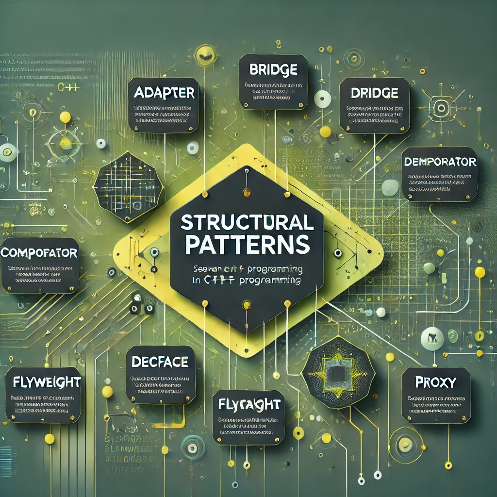

# [TheRayCode](../../README.md) is AWESOME!!!

[top](../README.md)

**[Creational Patterns](../Creational/README.md)** | **[Structural Patterns](../Structural/README.md)** | **[Behavioral Patterns](../Behavioral/README.md)**

**C++ Structural Patterns**

| examples using C++ | | | |
|----|---|---|---|
|**[Adapter](./Adapter/README.md)**  | [C#](../../Csharp/Structural/Adapter/README.md) | [Java](../../Java/Structural/Adapter/README.md) | [PHP](../../PHP/Structural/Adapter/README.md) |
|**[Bridge](./Bridge/README.md)**  | [C#](../../Csharp/Structural/Bridge/README.md) | [Java](../../Java/Structural/Bridge/README.md) | [PHP](../../PHP/Structural/Bridge/README.md) |
|**[Composite](./Composite/README.md)**  | [C#](../../Csharp/Structural/Composite/README.md) | [Java](../../Java/Structural/Composite/README.md) | [PHP](../../PHP/Structural/Composite/README.md) |
|**[+Decorator](./Decorator/README.md)**  | [C#](../../Csharp/Structural/Decorator/README.md) | [Java](../../Java/Structural/Decorator/README.md) | [PHP](../../PHP/Structural/Decorator/README.md) |
|**[Facade](./Facade/README.md)**  | [C#](../../Csharp/Structural/Facade/README.md) | [Java](../../Java/Structural/Facade/README.md) | [PHP](../../PHP/Structural/Facade/README.md) |
|**[Flyweight](./Flyweight/README.md)**  | [C#](../../Csharp/Structural/Flyweight/README.md) | [Java](../../Java/Structural/Flyweight/README.md) | [PHP](../../PHP/Structural/Flyweight/README.md) |
|**[Proxy](./Proxy/README.md)**  | [C#](../../Csharp/Structural/Proxy/README.md) | [Java](../../Java/Structural/Proxy/README.md) | [PHP](../../PHP/Structural/Proxy/README.md) |

### **Outline for Structural Patterns in C++**

Structural patterns focus on how classes and objects are composed to form larger structures, ensuring flexibility, efficiency, and scalability in the system. C++’s features like inheritance, composition, templates, and pointers make it a robust choice for implementing these patterns.

---

### **[1. Adapter Pattern](./Adapter/README.md)**
#### *Definition:*  
Converts the interface of a class into another interface that clients expect.

#### *How It Fits the Category:*  
The Adapter pattern bridges incompatible interfaces, allowing classes with different interfaces to work together seamlessly. This is especially useful in C++ for integrating legacy code or external libraries with modern systems.

#### *Implementation in C++:*
- Use **class adapters** by leveraging multiple inheritance to adapt one interface to another.
- Use **object adapters** by composing the adaptee class and implementing the desired interface.
- Examples include adapting a third-party library to fit your application's requirements.

---

### **[2. Bridge Pattern](./Bridge/README.md)**
#### *Definition:*  
Decouples an abstraction from its implementation so that the two can vary independently.

#### *How It Fits the Category:*  
The Bridge pattern separates abstraction and implementation into distinct hierarchies, promoting flexibility and scalability. It is commonly used in C++ for GUI frameworks or device drivers.

#### *Implementation in C++:*
- Define an `Abstraction` class with a pointer to an `Implementor` interface.
- Concrete implementations inherit from `Implementor`, while abstractions extend the `Abstraction` class.
- Use pointers or smart pointers (`std::unique_ptr` or `std::shared_ptr`) to manage implementation objects.

---

### **[3. Composite Pattern](./Composite/README.md)**
#### *Definition:*  
Composes objects into tree structures to represent part-whole hierarchies.

#### *How It Fits the Category:*  
The Composite pattern allows you to treat individual objects and groups of objects uniformly. It’s useful in C++ for scenarios like file systems, GUI components, or organizational hierarchies.

#### *Implementation in C++:*
- Define a `Component` interface with common methods.
- Implement `Leaf` (individual elements) and `Composite` (container) classes.
- Use pointers to manage child components dynamically, often with `std::vector` for child storage.

---

### **[4. Decorator Pattern](./Decorator/README.md)**
#### *Definition:*  
Adds new responsibilities to an object dynamically without altering its structure.

#### *How It Fits the Category:*  
The Decorator pattern enhances functionality by wrapping objects. In C++, this is achieved through object composition and polymorphism, making it a powerful pattern for adding features like logging or data compression.

#### *Implementation in C++:*
- Define a `Component` interface with common behavior.
- Create a `Decorator` class that implements the interface and wraps the component.
- Concrete decorators extend the `Decorator` class to add specific behavior.

---

### **[5. Facade Pattern](./Facade/README.md)**
#### *Definition:*  
Provides a simplified interface to a complex subsystem.

#### *How It Fits the Category:*  
The Facade pattern abstracts the complexity of subsystems by providing a single entry point. In C++, this is particularly useful for simplifying APIs or subsystems like graphics engines.

#### *Implementation in C++:*
- Create a `Facade` class that encapsulates the interactions with various subsystems.
- The client interacts only with the `Facade` to access subsystem functionality.
- Use this pattern to enhance code readability and reduce dependency on complex subsystems.

---

### **[6. Flyweight Pattern](./Flyweight/README.md)**
#### *Definition:*  
Reduces memory usage by sharing common data between similar objects.

#### *How It Fits the Category:*  
The Flyweight pattern optimizes resource usage by minimizing object duplication. In C++, this is valuable in scenarios like graphical applications or large-scale simulations.

#### *Implementation in C++:*
- Identify intrinsic state (shared among objects) and extrinsic state (specific to an object).
- Store intrinsic state in shared objects, managed by a `FlyweightFactory`.
- Use `std::unordered_map` or other containers to manage shared instances.

---

### **[7. Proxy Pattern](./Proxy/README.md)**
#### *Definition:*  
Provides a surrogate or placeholder for another object to control access to it.

#### *How It Fits the Category:*  
The Proxy pattern controls access, adds security, or enables lazy initialization. C++’s pointers and operator overloading make it effective for implementing proxies.

#### *Implementation in C++:*
- Create a `Proxy` class that implements the same interface as the real subject.
- The `Proxy` delegates requests to the real subject, adding control or functionality.
- Examples include virtual proxies for lazy initialization and protection proxies for access control.

---

### **Key Differences and Relations Within the Category:**
- **[Adapter](./Adapter/README.md)** converts interfaces, while **[Bridge](./Bridge/README.md)** decouples abstraction and implementation.
- **[Composite](./Composite/README.md)** works well with **[Decorator](./Decorator/README.md)**, allowing hierarchical structures with dynamic behavior.
- **[Flyweight](./Flyweight/README.md)** optimizes memory usage, often complementing **[Proxy](./Proxy/README.md)** to manage access to shared resources.
- **[Facade](./Facade/README.md)** simplifies subsystem usage, while **[Adapter](./Adapter/README.md)** ensures compatibility between mismatched interfaces.

---

### **How These Patterns Leverage C++ Features:**
1. **Inheritance and Polymorphism:**  
   Enable seamless implementation of Adapter, Bridge, and Decorator patterns.

2. **Templates:**  
   Provide flexibility and type safety for patterns like Composite and Flyweight.

3. **Smart Pointers:**  
   Simplify memory management in patterns like Proxy and Composite.

4. **Operator Overloading:**  
   Enhances usability in Proxy and Adapter implementations.

5. **STL Containers:**  
   Facilitate management of shared states (Flyweight) or child components (Composite).

---

By mastering these structural patterns in C++, developers can build scalable, maintainable, and efficient systems. The language’s object-oriented features, low-level control, and powerful standard libraries provide a strong foundation for implementing these patterns.

[TheRayCode.ORG](https://www.TheRayCode.org)

[RayAndrade.COM](https://www.RayAndrade.com)

[Facebook](https://www.facebook.com/TheRayCode/) | [X @TheRayCode](https://www.x.com/TheRayCode/) | [YouTube](https://www.youtube.com/TheRayCode/)
