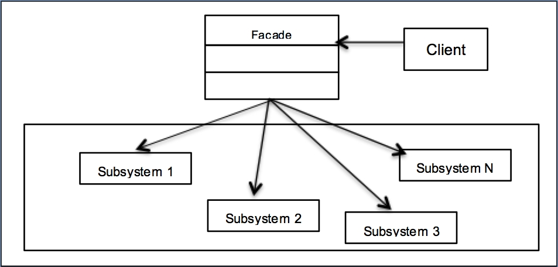

# [TheRayCode](../../../README.md) is AWESOME!!!

[top](../README.md)

**[Creational Patterns](../README.md)** | **[Structural Patterns](../../Structural/README.md)** | **[Behavioral Patterns](../../Behavioral/README.md)**

**C# Facade Design Pattern**

|Pattern|   |   |   |
|---|---|---|---|
| [**Facade**](README.md) | [C++](../../../CPP/Structural/Facade/README.md) | [Java](../../../Java/Structural/Facade/README.md) | [PHP](../../../PHP/Structural/Facade/README.md) |

[Example](Example/README.md) | [Example2](Example2/README.md) | [Example3](Example3/README.md)

**Facade Design Pattern**:
The Facade Design Pattern is a structural pattern that provides a simplified interface to a larger body of code, such as a library or a framework. The primary purpose is to hide the complexity of the system and offer a clear and easy-to-use interface to the client. By doing this, it decouples the client from the complex subsystem, promoting a loose coupling between them.

Key roles in the Facade pattern are:
1. **Facade**: This is the main class that provides a simplified interface to the complex subsystem.
2. **Subsystem Classes**: These classes perform the actual functionalities but might be complex or unwieldy to use directly.

**Why C# Programmers Should Study the Facade Design Pattern**:
1. **Simplification**: When building applications in C#, developers often have to interact with intricate systems, be it legacy code, third-party libraries, or complicated APIs. The Facade pattern helps in providing a streamlined interface to these systems, making them easier to work with.

2. **Loose Coupling**: The pattern promotes decoupling between the client and the subsystem. By isolating complexities behind a facade, changes made to the subsystem won't necessarily impact the client, fostering maintainability.

3. **Improved Readability**: A clean and clear interface provided by the facade enhances code readability. Developers can understand and utilize the functionality without diving deep into the intricacies of the subsystem.

4. **Enhanced Control**: The Facade can also control which features of the subsystem are exposed and which are hidden, allowing for a controlled access mechanism.

5. **Flexibility in System Evolution**: If a subsystem needs to evolve or change, you can keep the facade interface consistent. This means clients using the facade won't need changes, ensuring stability in the face of evolution.

6. **Integration with External Systems**: C# developers often interact with various systems, like databases, cloud services, or other external APIs. The Facade pattern is crucial when integrating these services, offering a unified interface irrespective of the external system's complexity.

7. **Reduction in Redundancy**: Instead of having multiple clients interact with the subsystem in potentially inconsistent ways, the facade ensures a standardized approach, reducing redundancy.

8. **Testability**: By providing a clear interface, the Facade pattern can make it easier to write unit tests. The facade can be tested in isolation, and mock objects can replace the complex subsystem for testing purposes.

In conclusion, the Facade Design Pattern provides C# programmers with a methodological approach to manage complexity in their applications. Given the wide array of libraries, frameworks, and systems a typical C# developer interacts with, understanding and implementing the Facade pattern becomes essential for building robust, maintainable, and efficient software solutions.

### **S.W.O.T. Analysis of the Facade Design Pattern in C#**

**Strengths**  
1. **Simplified Interface**: Provides a simplified interface to complex subsystems, making it easier for clients to use.  
2. **Encapsulation**: Hides implementation details, reducing dependencies on subsystems.  
3. **Enhanced Maintenance**: Easier to maintain as the Facade shields changes to subsystem internals.

**Weaknesses**  
1. **Overreliance**: Overreliance on the facade might obscure important details about subsystems.  
2. **Limited Flexibility**: Not suitable when granular control over subsystems is required.  
3. **Single Point**: The facade becomes a single point of failure if not designed robustly.

**Opportunities**  
1. **Legacy Code**: Wraps legacy code for seamless integration with modern C# systems.  
2. **Complex Systems**: Manages complex systems, simplifying usage in enterprise applications.  
3. **API Wrapping**: Serves as a wrapper for third-party API integrations in distributed systems.

**Threats**  
1. **Abstraction Overload**: Too many layers of abstraction may hinder performance and understanding.  
2. **Subsystem Changes**: Frequent changes in subsystems might require facade adjustments.  
3. **Direct Access**: Clients bypassing the facade can break encapsulation principles.

---

[TheRayCode.ORG](https://www.TheRayCode.org)

[RayAndrade.COM](https://www.RayAndrade.com)

[Facebook](https://www.facebook.com/TheRayCode/) | [X @TheRayCode](https://www.x.com/TheRayCode/) | [YouTube](https://www.youtube.com/TheRayCode/)
