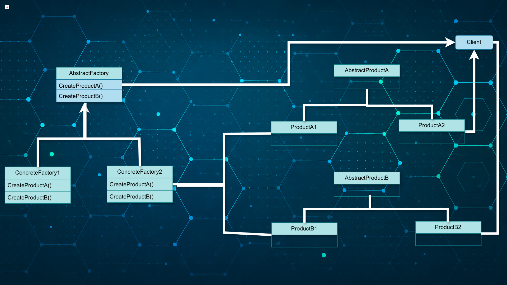

# [TheRayCode](../../README.md) is AWESOME!!!

[top](../README.md)

**[Creational Patterns](../README.md)** | **[Structural Patterns](../Structural/README.md)** | **[Behavioral Patterns](../Behavioral/README.md)**

**Python Creational Patterns**

**[Example](./Example/README.md)**

## What is Abstract Factory (Python) ?

* Creates **families of related objects**
  → Groups related objects together so they are created and used consistently.

* Uses a **factory interface** instead of direct instantiation
  → Client requests objects through methods instead of calling constructors directly.

* Hides **concrete class names** from the client
  → Client never references specific classes, only abstract interfaces.

* Ensures **compatible objects are used together**
  → Factory guarantees that related objects work correctly as a set.

* Client calls: `factory.create_*()` methods
  → Object creation happens through factory methods, not direct instantiation.

* Built using `ABC` and `abstractmethod` in Python
  → Python uses abstract base classes to define required factory behavior.

---

## Why Study Abstract Factory (Python) ?

1.* Separates **object creation from usage**
  → Keeps creation logic independent from the code that uses objects.

2.* Reduces **tight coupling** in client code
  → Client depends on abstractions, not specific implementations.

3.* Makes code **easier to extend and modify**
  → New families can be added without changing existing client code.

4.* Allows **easy swapping of product families**
  → Switching factories changes behavior without rewriting the client.

5.* Organizes code into **clear, structured layers**
  → Separates products, factories, and client responsibilities cleanly.

6.* Reinforces **GoF design pattern principles across languages**
  → Builds transferable knowledge usable in C++, Java, PHP, and Python.

## UML Structure

## Pattern: Abstract Factory

---

### Participant: AbstractFactory

1. Declares an interface for operations that create abstract product objects.
2. Defines methods for creating each kind of product family member.
3. Separates product creation from concrete implementation details.
4. Uses Python abstract base classes to enforce consistent factory behavior.

---

### Participant: ConcreteFactory

1. Implements operations that create concrete product objects.
2. Creates only products belonging to a specific product family.
3. Ensures related Python objects are used together consistently.
4. Returns concrete products through abstract product interfaces.

---

### Participant: AbstractProduct

1. Declares the interface for a type of product object.
2. Defines operations all concrete products must implement.
3. Allows products to be used polymorphically by the client.
4. Supports interchangeable object families within Python applications.

---

### Participant: ConcreteProduct

1. Implements the interface defined by the abstract product.
2. Represents a specific product variant within a product family.
3. Provides concrete behavior for Python application functionality.
4. Works correctly with related products created by the same factory.

---

### Participant: Client

1. Uses only interfaces declared by AbstractFactory and AbstractProduct classes.
2. Remains independent from concrete product implementation details.
3. Requests objects through factory methods instead of direct instantiation.
4. Switches product families by changing the concrete factory object.

---

[TheRayCode.ORG](https://www.TheRayCode.org)

[RayAndrade.COM](https://www.RayAndrade.com)

[Facebook](https://www.facebook.com/TheRayCode/) | [X @TheRayCode](https://www.x.com/TheRayCode/) | [YouTube](https://www.youtube.com/TheRayCode/)
