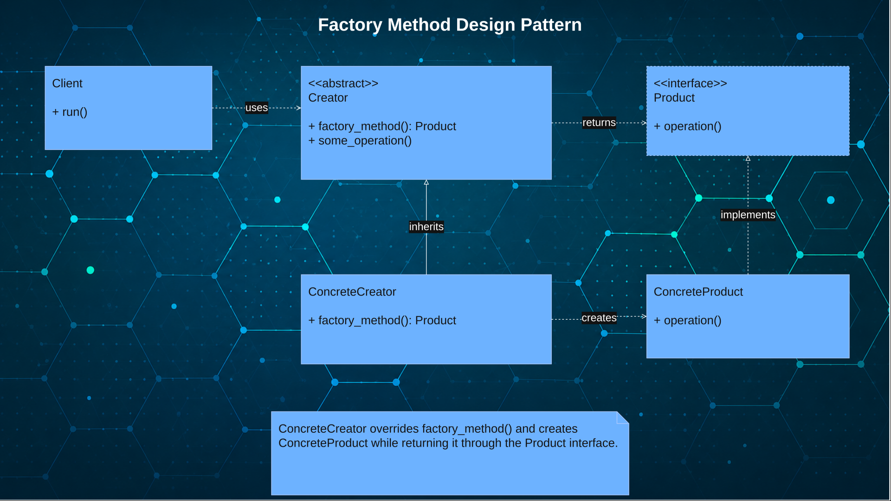

# [TheRayCode](../../../README.md) is AWESOME!!!

[top](../README.md)

**[Creational Patterns](../README.md)** | **[Structural Patterns](../../Structural/README.md)** | **[Behavioral Patterns](../../Behavioral/README.md)**

**Java Factory Design Pattern**

|Pattern|   |   |   |   |   |
|---|---|---|---|---|---|
|  [**Factory**](README.md) | [**C++**](../../../CPP/Creational/Factory/README.md) | [**C#**](../../../Csharp/Creational/Factory/README.md) | [**JS**](../../../JavaScript/Creational/Factory/README.md) | [**Java**](../../../Java/Creational/Factory/README.md)  | [PHP](../../../PHP/Creational/Factory/README.md) |

[Example1](./Example1/README.md) 

# Python Factory Method Design Pattern — WHAT / WHY

## WHAT

### What is the Factory Method Pattern?

The **Factory Method Pattern** is a **Creational Design Pattern** that defines an interface for creating objects while allowing subclasses to decide which object type will be created.

Instead of creating objects directly with constructors throughout the application, object creation is delegated to specialized factory methods.

### Short Definition

**Factory Method creates objects through a common interface while allowing subclasses to determine the concrete type created.**

### How it works in Python

In Python, the Factory Method pattern typically uses:

* A **Product** interface or abstract class
* One or more **ConcreteProduct** classes
* A **Creator** interface or abstract class
* One or more **ConcreteCreator** classes implementing the factory method

Python works well with Factory Method because:

* Dynamic typing simplifies object creation
* Inheritance is easy to implement
* Polymorphism supports interchangeable objects
* Object creation logic can be centralized

Typical flow:

```txt
Client
   ↓
Creator
   ↓
Factory Method()
   ↓
ConcreteCreator
   ↓
ConcreteProduct
```

Example concept:

Instead of writing:

```python
animal = Dog()
```

or:

```python
animal = Cat()
```

the client uses:

```python
animal = creator.factoryMethod()
```

The client works with an interface rather than knowing the specific object type.

# WHY

## Why should Python developers study the Factory Method Pattern?

### Reduces tight coupling

The client works with interfaces rather than directly creating concrete classes.

### Improves maintainability

Object creation logic remains in one location instead of scattered throughout the whole  applications.

### Supports scalable applications

New product types can be added with minimal modification to existing code.

### Encourages SOLID design principles

Factory Method supports the Open/Closed Principle by extending behavior without changing existing code.

### Simplifies object creation logic

Complex creation rules become easier to organize and understand.

### Language-specific notes for Python developers

Python allows simple object creation:

```python
dog = Dog()
```

For small applications this may be sufficient.

Factory Method becomes useful when:

* Many object types exist
* Creation rules become complex
* Applications must remain flexible
* Future expansion is expected
* Code reuse is important

## Student Summary

**Factory Method lets Python applications create objects through a common interface instead of directly creating classes.**

**Think of it like ordering food from a menu: you request the item, and the kitchen decides how it gets prepared.**


# ORM/UML Factory Method Python



## Pattern: The Factory Method UML ORM with a focus toward Python

## Participant: Product
1. Declares the common interface for objects created by the factory method.
2. Allows clients to use products without depending on concrete classes.
3. In Python, this is commonly represented with an abstract base class.
4. ConcreteProduct classes implement Product and are returned by Creator.

## Participant: ConcreteProduct
1. Implements the Product interface with specific object behavior.
2. Represents the actual object created by the factory method.
3. In Python, each ConcreteProduct can override shared behavior differently.
4. Creator returns ConcreteProduct objects through the Product interface.

## Participant: Creator
1. Declares the factory method that returns a Product object.
2. Defines object creation without directly naming concrete product classes.
3. In Python, this often uses an abstract `factoryMethod()` method.
4. ConcreteCreator overrides the method to choose the created product.

## Participant: ConcreteCreator
1. Overrides the factory method to create a specific ConcreteProduct.
2. Encapsulates which product class should be instantiated.
3. In Python, this method returns an instance of a ConcreteProduct class.
4. Client code uses Creator while ConcreteCreator handles object selection.

## Student Summary

* **Product** → Defines the common interface for created objects.
* **ConcreteProduct** → Provides the specific object behavior.
* **Creator** → Declares the factory method for object creation.
* **ConcreteCreator** → Creates and returns the specific product object.

# S.W.O.T. Analysis – Factory Method Pattern in Python

## Strengths

### 1. Promotes Loose Coupling

Clients work with abstract products instead of concrete classes.

### 2. Easier to Extend

New product types can be added without changing existing client code.

### 3. Supports Open/Closed Principle

The system is open for extension but closed for modification.

---

## Weaknesses

### 1. More Classes Required

Factory Method introduces additional creator and product classes.

### 2. Increased Complexity

Small projects may not benefit from the extra abstraction.

### 3. Harder for Beginners

The relationship between creators and products can be confusing initially.

---

## Opportunities

### 1. Build Flexible Applications

Ideal for systems that create different object types dynamically.

### 2. Improve Code Maintainability

Changes to product creation remain isolated in factory classes.

### 3. Prepare for Advanced Patterns

Factory Method provides a foundation for Abstract Factory and Prototype.

---

## Threats

### 1. Overengineering Small Projects

Using Factory Method where simple object creation is sufficient adds unnecessary complexity.

### 2. Excessive Class Growth

Large systems may accumulate many factory and product classes.

### 3. Poor Documentation

Without clear UML and naming conventions, developers may misuse the pattern.

---

### Student Summary

Factory Method is a Creational Design Pattern that delegates object creation to specialized factory methods. In Python, it helps create flexible, maintainable, and extensible applications while reducing direct dependencies on concrete classes. Although it introduces additional classes and complexity, it is a valuable pattern for developers building scalable software systems.


[TheRayCode.ORG](https://www.TheRayCode.org)

[RayAndrade.COM](https://www.RayAndrade.com)

[Facebook](https://www.facebook.com/TheRayCode/) | [X @TheRayCode](https://www.x.com/TheRayCode/) | [YouTube](https://www.youtube.com/TheRayCode/)


