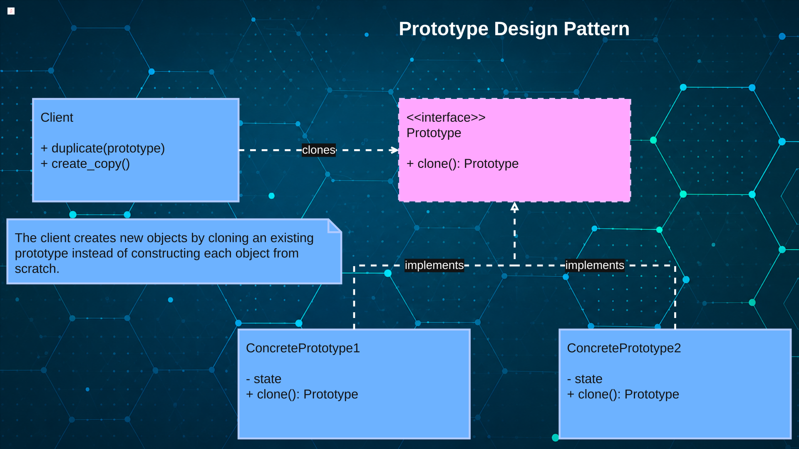

# [TheRayCode](../../../README.md) is AWESOME!!!

[top](../README.md)

**[Creational Patterns](../README.md)** | **[Structural Patterns](../../Structural/README.md)** | **[Behavioral Patterns](../../Behavioral/README.md)**

**Python Prototype Design Pattern**

|Pattern|   |   |   |   |   |
|---|---|---|---|---|---|
|  [**Prototype**](README.md) | [**C++**](../../../CPP/Creational/Prototype/README.md) | [**C#**](../../../Csharp/Creational/Prototype/README.md) | [**Java**](../../../Java/Creational/Prototype/README.md) | [**JS**](../../../JavaScript/Creational/Prototype/README.md) | [**PHP**](../../../PHP/Creational/Prototype/README.md) |

[Example1](Example1/) 


** # What Is the Prototype Design Pattern?

The **Prototype Design Pattern** is a **creational design pattern** from the Gang of Four (GoF).

Prototype creates new objects by **copying or cloning an existing object** rather than constructing each new object from scratch.

** In Python, this idea fits naturally with the `copy` module. A prototype object can be duplicated using `copy.copy()` for a **shallow copy** or `copy.deepcopy()` for a **deep copy**.

The basic idea is:

```text
Existing Object
      │
      │ clone
      ▼
   New Object
```
** 
Instead of saying:

> "Build me another object and configure everything again."

Prototype says:

> "I already have an object configured the way I want. Give me a copy of it."

** 4x. # Why Should a Python Student Study the Prototype design pattern?

**Learn Object Creation Beyond Constructors**
   Prototype demonstrates that creating an object does not always require calling a class constructor and rebuilding its state.

**Understand Shallow and Deep Copying**
   Studying Prototype provides a practical reason to understand Python's `copy.copy()` and `copy.deepcopy()`.

**Reuse Existing Object Configuration**
   A configured object can serve as a template for creating additional objects with similar state.

**Reduce Complicated Initialization**
   Cloning can avoid repeatedly performing complex setup when an appropriate object already exists.

**Reduce Dependency on Concrete Classes**
   Client code can request a clone without needing to know exactly how a particular concrete object is constructed.

**Understand Mutable Object State**
   Prototype helps expose an important Python concept: copied objects may still share references to mutable objects such as lists and dictionaries.

**Practice Object-Oriented Polymorphism**
   Different prototype classes can provide a common `clone()` operation while controlling how their own objects are copied.

**Recognize When Copying Is Better Than Rebuilding**
   Prototype teaches students to evaluate whether creating an object from an existing example is simpler than constructing it from the beginning.

**Learn a Gang of Four Creational Pattern**
   Prototype belongs with **Abstract Factory, Builder, Factory Method, and Singleton** in the GoF creational-pattern family.

**Improve Software Design Decisions**
    Understanding Prototype gives a Python programmer another option when deciding how objects should be created, configured, and duplicated.

## Summary

**Prototype means creating a new object by copying an existing object.**

For a Python student, the most important lesson is not simply learning `copy()`. It is understanding **when cloning an existing configured object is a better design than constructing and configuring another object from scratch.**


# Creational Pattern:  Prototype with cosideration in python





## Participant: Prototype

1. Declares the interface for cloning an existing object.
2. In Python, this is commonly represented by a base class or abstract base class containing a method such as `clone()`.
3. Defines the cloning contract that **ConcretePrototype** objects provide.
4. Allows the **Client** to request copies without depending on the concrete class of the object being copied.

## Participant: ConcretePrototype

1. Implements the cloning operation defined by **Prototype**.
2. Creates a new object whose state is copied from the existing prototype.
3. In Python, cloning can commonly use `copy.copy()` for a shallow copy or `copy.deepcopy()` when nested mutable objects must also be copied.
4. Returns the cloned object so the **Client** can modify the copy independently when the copied state permits it.

## Participant: Client

1. Creates new objects by asking a **Prototype** to clone itself.
2. Works through the Prototype interface instead of directly constructing a specific **ConcretePrototype**.
3. In Python, the Client works with object references and normally does not perform explicit pointer or memory management.
4. Can create differently configured objects by cloning different prototype instances rather than repeating their initialization logic.

# Student Summary

**Prototype:** Defines how an object can be cloned. It gives the Client a common way to request a copy.

**ConcretePrototype:** Performs the actual copying. In Python, `copy.copy()` and `copy.deepcopy()` are common tools for implementing this responsibility.

**Client:** Requests new objects by cloning existing prototypes instead of constructing and configuring every object from scratch.

## S.W.O.T. Analysis using Python with the Prototype design pattern 

## Strengths

**Simple Object Duplication**
  Copies existing objects quickly without repeatedly invoking complex constructors.

**Flexible Runtime Cloning**
  Creates customized instances dynamically using Python's powerful object copying capabilities.

**Reduced Initialization Cost**
  Reuses prepared objects, minimizing expensive setup operations for new instances.

## Weaknesses

**Complex Deep Copying**
  Nested object references complicate implementing correct deep cloning behavior.

**Hidden Shared State**
  Shallow copies may unintentionally share mutable data between cloned objects.

**Clone Maintenance Overhead**
  Every class requires careful cloning logic as attributes evolve over time.

## Opportunities

**Game Object Templates**
  Clone enemies, characters, and items efficiently from predefined prototype objects.

**Configuration Replication**
  Duplicate application settings quickly while modifying only required configuration values.

**Framework Integration Benefits**
  Combine Prototype with Factory or Builder for flexible object creation workflows.

## Threats

**Improper Copy Implementation**
  Incorrect clone methods introduce subtle bugs that are difficult to diagnose.

**Memory Consumption Growth**
  Excessive cloned objects increase application memory usage and management complexity.

**Unnecessary Pattern Usage**
  Simple constructors may outperform Prototype, reducing readability without meaningful benefits.


[TheRayCode.ORG](https://www.TheRayCode.org)  

[RayAndrade.COM](https://www.RayAndrade.com)

[Facebook](https://www.facebook.com/TheRayCode/) | [X @TheRayCode](https://www.x.com/TheRayCode/) | [YouTube](https://www.youtube.com/TheRayCode/)
