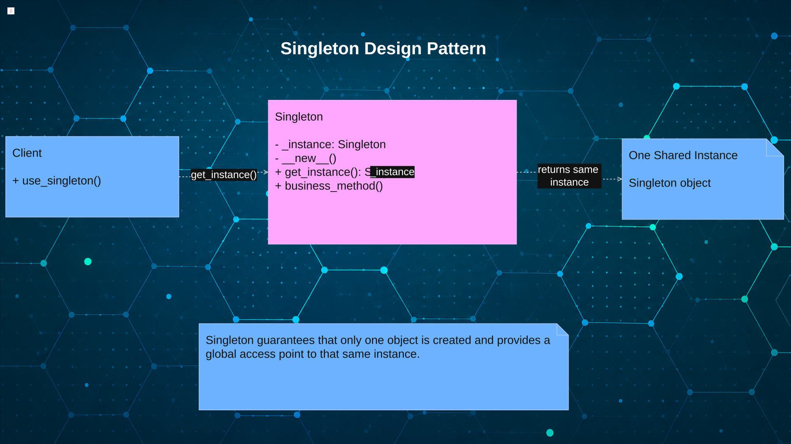

# [TheRayCode](../../../README.md) is AWESOME!!!

[top](../README.md)

**[Creational Patterns](../README.md)** | **[Structural Patterns](../../Structural/README.md)** | **[Behavioral Patterns](../../Behavioral/README.md)**

**Python Singleton Design Pattern**

|Pattern|   |   |   |   |
|---|---|---|---|---|
|  [**Singleton**](README.md) | [**C++**](../../../CPP/Creational/Singleton/README.md) | [**C#**](../../../Csharp/Creational/Singleton/README.md) | [**JavaScript**](../../../JavaScript/Creational/Singleton/README.md) | [**PHP**](../../../PHP/Creational/Singleton/README.md) |

# What Is the Singleton Design Pattern?

The **Singleton Design Pattern** is a **creational design pattern** from the Gang of Four (GoF).

Singleton ensures that a class has **only one instance** and provides a controlled way for the rest of the application to access that instance.

The basic idea is:

```text
        Client
           │
           │ requests
           ▼
      Singleton
           │
           │
           ▼
   One Shared Instance
```

Instead of different parts of an application repeatedly creating their own objects:

```python
service1 = Service()
service2 = Service()
service3 = Service()
```

Singleton provides a way for them to work with **one shared instance**.

# Why Should a Python Student Study Singleton design pattern?

**Understand Controlled Object Creation**
   Singleton demonstrates how a class can control when and how its objects are created.

**Learn How to Maintain One Shared Instance**
   Students learn how different parts of a program can access the same object instead of repeatedly creating new ones.

**Understand Python's `__new__()` Method**
   Implementing Singleton is a practical way to learn how `__new__()` controls object creation before `__init__()` initializes an object.

**Practice Class-Level State**
   Singleton commonly uses a class attribute such as `_instance` to remember the single object that has already been created.

**Recognize Shared Resources**
   Singleton helps students think about resources that may need centralized access, such as configuration, logging, caches, or application services.

**Understand Object Identity**
   Students can see that two variables can reference the exact same Python object rather than merely containing equivalent objects.

**Learn the Difference Between Creation and Access**
  Singleton separates the idea of creating the single instance from obtaining access to that existing instance.

**Recognize the Risks of Global State**
   Studying Singleton teaches that convenient shared access can also create hidden dependencies and make testing more difficult.

**Learn a Gang of Four Creational Pattern**
   Singleton belongs with **Abstract Factory, Builder, Factory Method, and Prototype** in the GoF creational-pattern family.

**Learn When NOT to Use a Pattern**
    Singleton is especially valuable for students because it demonstrates that a design pattern can solve a real problem while also introducing trade-offs if it is overused.

## Student Summary

**Singleton means one class, one shared instance, with a controlled way to access it.**
For a Python student, the larger lesson is not simply learning how to write a Singleton. It is learning to recognize **when one shared object is appropriate—and when ordinary object creation and dependency passing would produce a cleaner design.**

# Pattern: Creational Singleton





## Participant: Singleton

1. Defines the operation that gives clients access to the single shared instance.
2. In Python, the class commonly stores that instance in a class attribute such as `_instance`.
3. It controls object creation so repeated access returns the same object instead of creating new independent objects.
4. Python implementations may use `__new__()`, a class method, or another controlled access technique rather than explicit pointers or manual memory management.

## Student Summary

**Singleton:** The Singleton class is responsible for creating, storing, and returning the one shared instance. In Python, students should focus on class-level state, object identity, and controlled creation rather than pointer ownership or manual deletion.

# SWOT — Singleton Design Pattern in Python

## Strengths

**Guarantees a Single Shared Instance**
   Singleton provides controlled access to one object when an application should have only one shared instance.

**Provides Centralized Resource Access**
   Resources such as configuration settings, logging services, or shared application state can be accessed from a common location.

**Avoids Repeated Object Creation**
   Python can reuse the existing Singleton instance instead of repeatedly constructing equivalent objects.

## Weaknesses

**Introduces Global-Like State**
   A Singleton can behave like a global variable, making it harder to determine which parts of the program modify shared state.

**Makes Unit Testing More Difficult**
   Tests may influence one another when they share the same Singleton instance and its internal state.

**Creates Hidden Dependencies**
   Classes can access the Singleton directly, making their dependency on that shared object less obvious.

## Opportunities

**Centralizes Application Configuration**
   Singleton can provide one controlled object for application-wide configuration that many Python components need to access.

**Coordinates Shared Services**
   Logging, caching, resource managers, and similar services can sometimes benefit from a single coordinated access point.

**Teaches Python Object Creation**
   Implementing Singleton gives students practical experience with class attributes, object identity, `__new__()`, and class-level behavior.

## Threats

**Can Become an Overused Global Object**
   Developers may use Singleton simply for convenient access rather than because the application truly requires one instance.

**Can Increase Application Coupling**
   When many classes depend directly on the Singleton, changing or replacing that shared service can become difficult.

**Can Create Concurrency Problems**
   If multiple threads can create or modify the shared instance, the implementation may require synchronization to prevent inconsistent behavior.

## TRC Student Takeaway

**Singleton is useful when the application genuinely needs one controlled, shared instance.**

Its greatest advantage—**easy access to shared state**—can also become its greatest disadvantage. A Python student should learn both **how to implement Singleton and how to recognize when a simpler dependency or ordinary object would be the better design.**

[TheRayCode.ORG](https://www.TheRayCode.org)  

[RayAndrade.COM](https://www.RayAndrade.com)

[Facebook](https://www.facebook.com/TheRayCode/) | [X @TheRayCode](https://www.x.com/TheRayCode/) | [YouTube](https://www.youtube.com/TheRayCode/)

